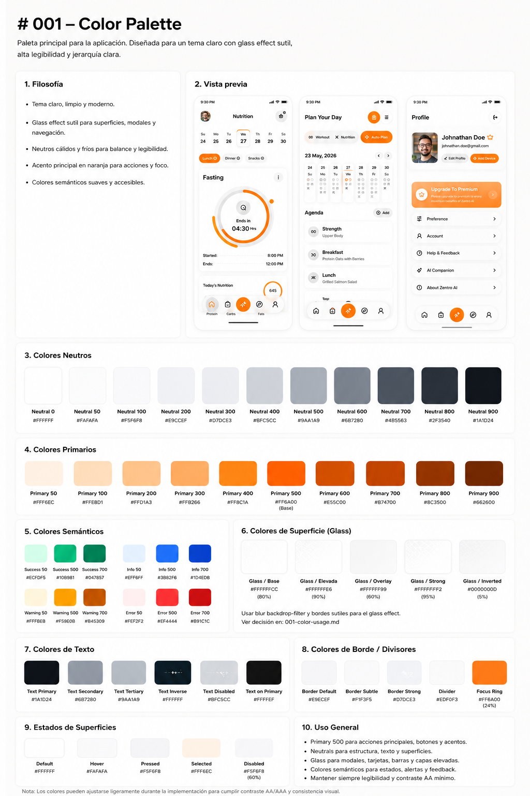

# 001 - Color Palette

## Objetivo

Definir una paleta consistente para toda la aplicación que transmita una apariencia moderna, premium y altamente legible.

La paleta prioriza claridad, jerarquía visual y consistencia por encima de la variedad de colores.

---

## Filosofía

* Tema claro como experiencia principal.
* Glass effect sutil para elementos elevados.
* Neutros como base de toda la interfaz.
* El color primario debe utilizarse únicamente para dirigir la atención del usuario.
* Los colores semánticos deben comunicar estado de forma inmediata.
* Mantener contraste AA como mínimo en toda la interfaz.

---

## Glass Effect

El glass effect forma parte del sistema de superficies.

Se utilizará únicamente en componentes elevados como:

* Bottom Navigation
* Floating Action Buttons
* Modales
* Dropdowns
* Menús contextuales
* Paneles flotantes
* Overlays

No utilizar glass como fondo principal de la aplicación.

La prioridad siempre será la legibilidad.

---

## Roles del color

### Neutros

Se utilizan para:

* Fondos
* Cards
* Texto
* Bordes
* Divisores
* Estructura general

Representan aproximadamente el 80–90% de la interfaz.

### Color primario

Se utiliza para:

* Botones principales
* Estado activo
* Navegación seleccionada
* Indicadores
* Focus
* Acciones importantes

No utilizar sobre superficies grandes.

### Colores semánticos

Se utilizan exclusivamente para comunicar estados:

* Success
* Warning
* Error
* Information

Nunca deben reemplazar al color primario.

---

## Superficies

Las diferencias entre niveles de elevación deben lograrse mediante:

* Sombras
* Blur
* Transparencia
* Bordes sutiles

No mediante cambios fuertes de color.

---

## Reglas

* Reducir la cantidad de colores visibles por pantalla.
* Mantener una jerarquía visual clara.
* Utilizar el color primario únicamente para dirigir la atención.
* Priorizar siempre la legibilidad.
* Mantener consistencia entre todas las pantallas.
* Antes de introducir un color nuevo, validar si uno existente puede cumplir la misma función.

---

## Implementación

Los valores definidos en este documento servirán como base para:

* Tailwind Theme
* Design Tokens
* Componentes reutilizables
* Estados de interacción
* Sistema de superficies
* Glass System
