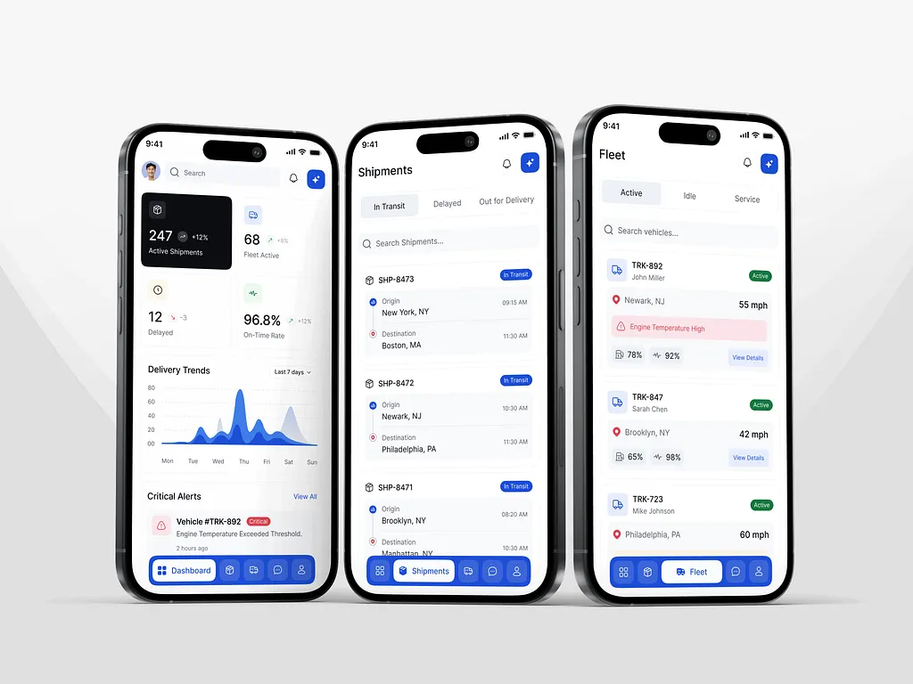
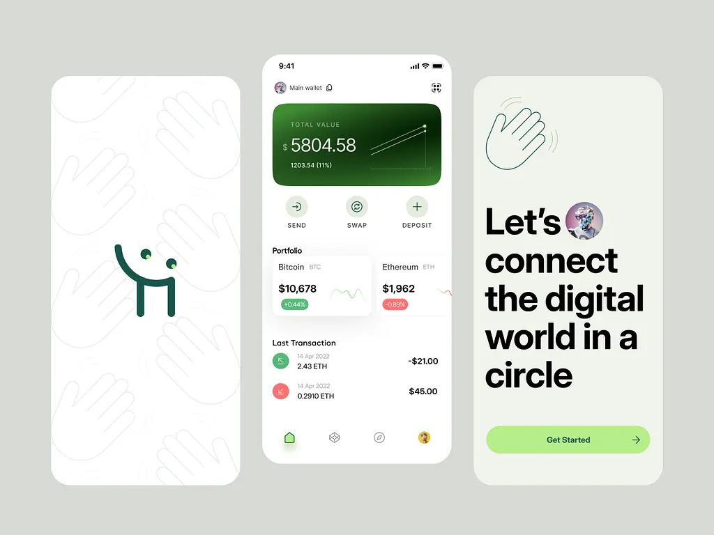
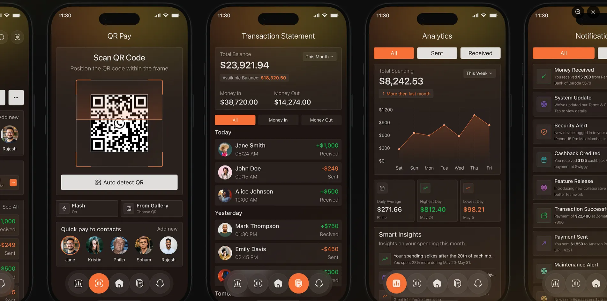
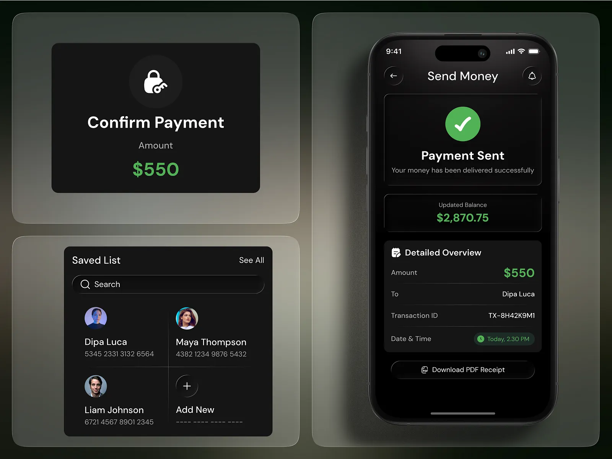
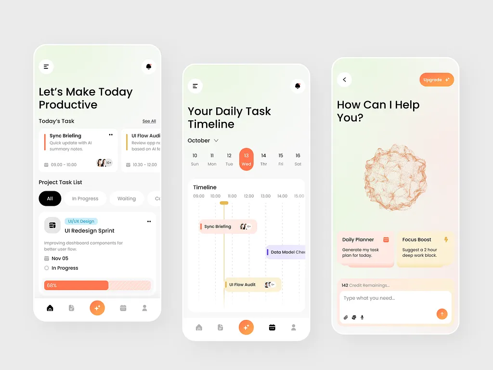
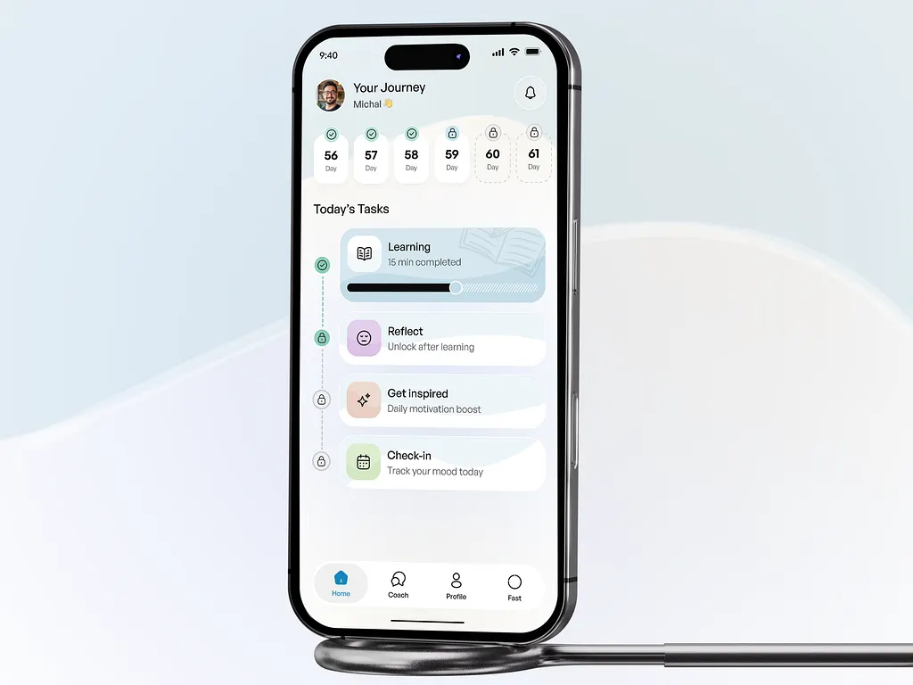
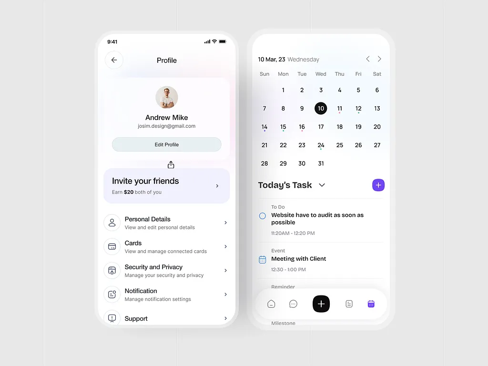

# Design System

## Objetivo

Construir una aplicación web moderna, premium y mobile-first que sirva como demostración de aplicaciones operativas personalizadas para negocios de servicios.

El diseño debe transmitir calidad, claridad y confianza. Debe sentirse como una aplicación nativa moderna y no como un dashboard web tradicional.

---

# Prioridad de implementación

Cuando exista conflicto entre distintas referencias, se seguirá este orden:

1. `docs/decisions/`
2. `docs/design-assets/`
3. `docs/design-system.md`
4. Referencias visuales

Las referencias visuales nunca deben copiarse literalmente. Solo sirven para comunicar la dirección estética.

---

# Stack visual

* React
* Vite
* Tailwind CSS v4
* Framer Motion
* Lucide React

---

# Tema

Claro.

La interfaz debe utilizar fondos claros, superficies limpias y una jerarquía visual muy marcada.

---

# Dirección visual

La aplicación debe sentirse:

* moderna
* premium
* limpia
* elegante
* ligera
* altamente legible
* orientada a productividad

Debe parecer una aplicación móvil profesional adaptada al navegador.

No debe parecer un dashboard SaaS genérico.

---

# Referencias visuales

## Referencias










## Qué me gusta

* Glass effect sutil.
* Mucha información visible sin sentirse saturada.
* Excelente jerarquía visual.
* Uso inteligente del espacio.
* Cards compactas.
* Espaciado consistente.
* Navegación muy simple.
* Interfaces tipo aplicación móvil.
* Animaciones suaves.
* Componentes modernos.
* Buen balance entre contenido y espacios vacíos.

## Qué quiero evitar

* Pantallas con demasiado espacio desperdiciado.
* Cards enormes con poco contenido.
* Dashboard SaaS tradicional.
* Glassmorphism exagerado.
* Gradientes excesivos.
* Colores muy saturados.
* Sombras pesadas.
* Componentes infantiles.

---

# Colores

Ver:

`docs/decisions/001-color-palette.md`

---

# Tipografía

Utilizar el system font stack inspirado en Apple.

```css
font-family:
  -apple-system,
  BlinkMacSystemFont,
  "SF Pro Display",
  "SF Pro Text",
  "Inter",
  "Segoe UI",
  sans-serif;
```

No descargar fuentes.

---

# Layout

## Filosofía

Mobile-first.

La experiencia debe sentirse primero como una aplicación móvil y luego escalar naturalmente a escritorio.

## Navegación móvil

Bottom Navigation.

## Navegación escritorio

Sidebar izquierda.

## Densidad

Media-alta.

Debe aprovechar el espacio disponible mostrando bastante información por pantalla sin comprometer la legibilidad.

## Jerarquía

Priorizar siempre:

1. Información importante.
2. Acciones principales.
3. Información secundaria.

---

# Componentes base

Los componentes se documentan individualmente en:

`docs/design-assets/`

Categorías:

* Buttons
* Cards
* Inputs
* Dropdowns
* Tables
* Navigation
* Modals
* Mobile
* Badges
* Charts
* Loaders
* Animations

---

# Motion

Ver:

`docs/decisions/003-motion.md`

Principios:

* rápido
* natural
* suave
* consistente

Las animaciones deben mejorar la experiencia, nunca distraer.

---

# Componentes externos

Solo aceptar componentes que sean:

* React
* Tailwind
* Responsive
* Accesibles
* Fácilmente modificables
* Sin dependencias innecesarias

Prioridad:

1. React + Tailwind
2. React + CSS
3. HTML + CSS

No utilizar:

* Bootstrap
* Material UI
* Chakra UI
* Vue
* Svelte
* Lit

---

# Filosofía general

Cada pantalla debe sentirse diseñada específicamente para el usuario final.

La aplicación debe priorizar:

* rapidez para encontrar información
* claridad
* consistencia
* simplicidad
* estética premium

La interfaz debe aprovechar el espacio disponible mostrando la mayor cantidad de información útil posible sin sentirse cargada.
